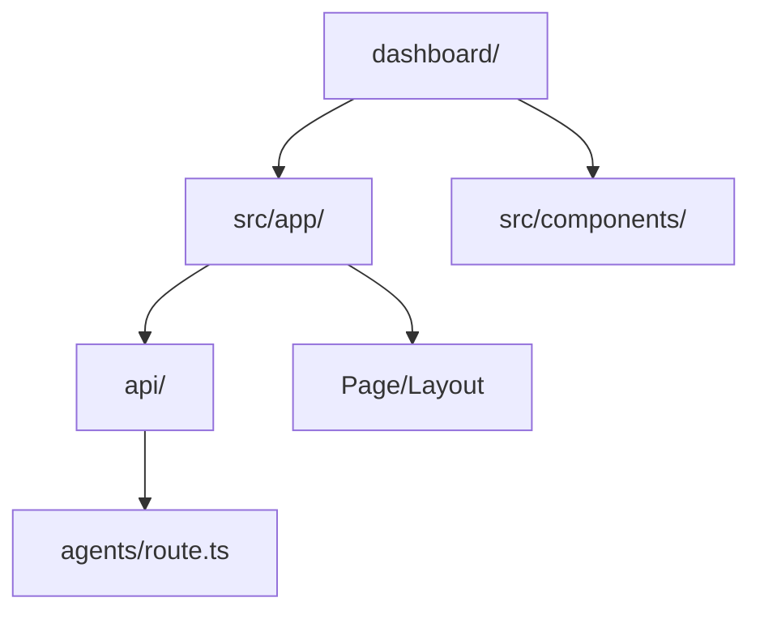

# 🕵️ Inventory: CoreBrain Dashboard

**Resumo Executivo**: Dashboard administrativo para gestão de agentes e orquestração do CoreBrain, construído com Next.js e Tailwind CSS.

## 🛠️ Stack Tecnológica
- **Framework**: Next.js 14+ (App Router)
- **Linguagem**: TypeScript
- **Estilização**: Tailwind CSS + Shadcn/UI (Inferido)
- **Runtime**: Node.js
- **Gestão de Pacotes**: npm

## 🏗️ Estrutura de Pastas (Topologia)

## 📍 Pontos de Entrada (Entry Points)
1.  **Frontend**: `src/app/page.tsx` (Main Dashboard UI)
2.  **Layout**: `src/app/layout.tsx` (Global Providers & Structure)
3.  **API**: `src/app/api/agents/route.ts` (Agent Orchestration Logic)
4.  **Config**: `tailwind.config.ts` & `next.config.mjs`

## 🟢 Traceability Marks
- 🟢 **CONFIRMED**: Uso de Next.js App Router via estrutura `src/app`.
- 🟢 **CONFIRMED**: API de agentes em `src/app/api/agents/route.ts`.
- 🟡 **INFERRED**: Uso de Shadcn/UI baseado nos padrões de componentes observados em conversas anteriores.
- 🔴 **GAP**: Não foi localizado o arquivo de configuração de banco de dados no nível do dashboard (pode estar no root do CoreBrain).

---
*Gerado via Skill: Scout*
